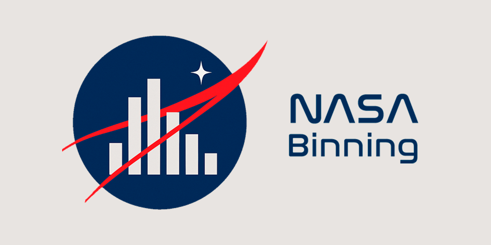

# 🚀 NASABinning

<p align="center">
  
</p>

Desenvolvido para facilitar a decisão de agrupamento de variáveis numéricas e categóricas.

## Visão geral

O NASABinning prioriza **estabilidade temporal** das taxas de evento. A biblioteca
utiliza o `OptimalBinning` como base única para a geração dos cortes e o
`Optuna` apenas para buscar seus hiperparâmetros (``max_bins``, ``min_bin_size`` etc.).
O objetivo é encontrar binagens que mantenham curvas de `event rate` bem separadas e
consistentes mês a mês.

Para medir essa qualidade é empregada a função
`temporal_separability_score`, que calcula a distância média entre as curvas de
cada bin ao longo das safras. Métricas clássicas como IV e KS continuam sendo
computadas, porém com peso secundário na seleção final dos bins.
O score utilizado na otimização segue a fórmula:

```
score = 0.7 * separabilidade + 0.2 * IV + 0.1 * KS
```

## Principais recursos

| Recurso | Descrição |
|---------|-----------|
| **Binning supervisionado e não supervisionado** | Estratégias plug-and-play (Optimal Binning, quantílico, largura fixa, k-means). |
| **Monotonicidade opcional** | Respeita tendências crescentes ou decrescentes para facilitar interpretação regulatória. |
| **Diferença mínima de **event rate**** | Evita sobreposição de grupos ao unir automaticamente bins muito semelhantes. |
| **Estabilidade temporal** | Calcula PSI, KS e o `temporal_separability_score` para priorizar curvas consistentes ao longo dos meses. |
| **Otimização com Optuna (opcional)** | Explora hiperparâmetros do `OptimalBinning` visando maior separabilidade temporal; IV e KS servem como apoio na decisão. |
| **Integração scikit-learn** | `NASABinner` implementa ``fit`/`transform``, permitindo uso em `Pipeline`. |
| **Relatórios auditáveis** | Geração de tabelas e gráficos em `.xlsx`, `.json` e Matplotlib para `WoE`, event-rate e estabilidade. |


> ⚠️ Ideal para cientistas de dados que atuam com modelagem de `risco de crédito`, `scorecards` e precisam entregar resultados robustos e rastreáveis para auditorias ou produção.

---


## 📦 Instalação (em breve)

```bash
# futura distribuição PyPI
pip install nasabinning 
```


### Para desenvolvimento, clone o repositório e instale dependências extras:
```bash
git clone https://github.com/seu-usuario/NASABinning.git
cd NASABinning
pip install -e ".[dev]"
```

### Exemplo rápido
```python
import pandas as pd
from nasabinning import NASABinner

# X: DataFrame de features; y: Series binária; time_col: safra (YYYYMM)
binner = NASABinner(
    strategy          = "supervised",
    min_event_rate_diff = 0.03,
    check_stability   = True,
    monotonic         = True,
    use_optuna        = False
)

binner.fit(X, y, time_col="AnoMesReferencia")
X_woe = binner.transform(X, return_woe=True)

# Relatório de estabilidade temporal
binner.plot_event_rate_stability()
binner.save_report("reports/binning_report.xlsx")
```

## 📁 Estrutura de Pastas (resumida)
```bash
nasabinning/
├─ __init__.py
├─ binning_engine.py
├─ refinement.py
├─ temporal_stability.py
├─ metrics.py
├─ reporting.py
├─ compare.py
├─ strategies/
│   ├─ supervised.py
│   └─ unsupervised.py
└─ optuna_optimizer.py
```


## 🛣️ Roadmap

v0.1 — MVP supervisionado (Optimal Binning)

v0.2 — Estratégias não supervisionadas e integração total scikit-learn

v0.3 — Módulo de comparação (compare.py) com relatórios paralelos

v1.0 — Publicação no PyPI e documentação completa

## 🤝 Contribuindo
Abra uma issue descrevendo a proposta de melhoria ou bug.

Crie um fork e uma branch: `git checkout -b` feature/nome.

Execute `pytest` antes de abrir o pull request.

Siga o guia de estilo definido em `docs/contrib_guidelines.md` (em breve).

## 📄 Licença
Distribuído sob a licença MIT. Consulte o arquivo `LICENSE` para detalhes.


## 📬 Contato
Para dúvidas ou sugestões, abra uma issue ou envie e-mail para [maia.ufrrj@gmail.com](mailto:maia.ufrrj@gmail.com).